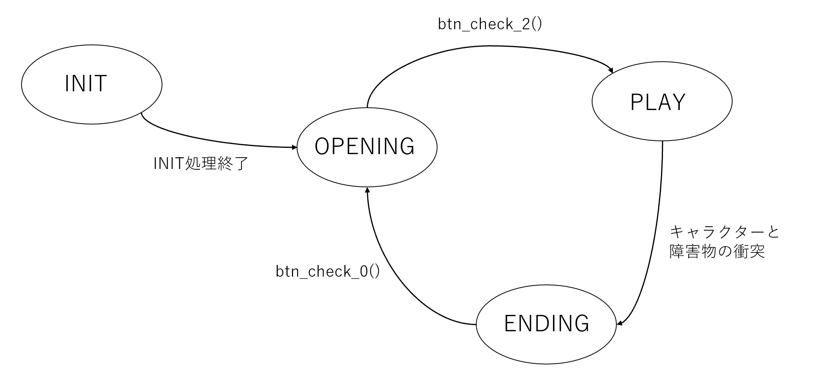
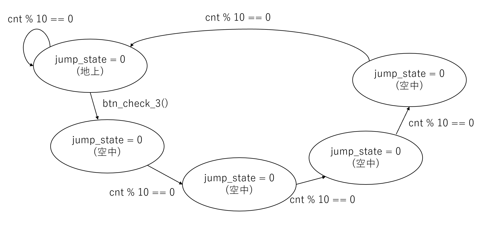

# 内部仕様書

# 状態遷移図

## ゲーム状態の遷移



## プレイヤージャンプ時の遷移



# フローチャート

## 用いられる変数の意味


**外部変数**
```c
int beep_counter = 0; //ブザー音なり始めからの時間を管理
int beep_counter_2 = 0; // ブザー音なり始めからの時間を管理
int cursor_state = 0; // openingでの難易度選択カーソルの状態保持

int state = INIT; //ゲームの場面管理 (opening, play, ending)
int counter; // 画面、オブジェクトの更新のための時間を管理
int jump_state = 0; // ジャンプ状態でのキャラクター状態管理
int jump_counter = 0; // ジャンプ状態での時間を管理

int vacant_counter = 0; // ランダム生成障害物の間隔を管理 
int obst_counter = 0; // ランダム生成障害物の連続数を管理
```

**関数**

```c
void play(); // ゲームプレイのメインループ
int btn_check_0(); // ボタン0の状態をチェック
int btn_check_1(); // ボタン1の状態をチェック
int btn_check_2(); // ボタン2の状態をチェック
int btn_check_3(); // ボタン3の状態をチェック
void lcd_wait(int n); // LCDの待機時間設定
void lcd_cmd(unsigned char cmd); // LCDにコマンドを送信
void lcd_data(unsigned char data); // LCDにデータを送信
void lcd_init(); // LCDを初期化
void jump_up(); // キャラクターをジャンプさせる
void jump_down(); // キャラクターを下降させる
void game_over(); // ゲームオーバー処理
void opening(); // オープニング処理
void ending(); // エンディング処理

void lcd_customchar(unsigned int addr, unsigned int *bitmap); // カスタム文字をLCDに設定
void beep(); // ビープ音を鳴らす
void beep2(); // 異なるビープ音を鳴らす
int lcgs(); // 疑似乱数生成器
void show_rand_floor(); // ランダムな床を表示
void show_character(); // キャラクターを表示
void seg7(int x); // 7セグメントディスプレイに数値表示
void title_screen(); // タイトル画面を表示
void titel_cursor(); // タイトル画面のカーソルを表示
void interrupt_handler(); // 割り込みハンドラ
```
## main関数とinterrupt handler (左がmain関数、右がinterrupt_handler)


## main()におけるopening()とplay


## iinterrupt_handler()内のshow_character()とshow_rand_floor()


## interrupt_handler()内におけるtitle_cursor()


# 自分が実装した部分の解説

## ゲームのプレイ中のボタン受付play()

ゲームプレイ中は、以下のplay()中のwhile(1)のループが行われている。この間では、ゲームのプレイヤー操作に応じてジャンプアクションがトリガーされる。
具体的には、jump_state 変数を使用してプレイヤーがジャンプ中でないことを確認し、btn_check_3() 関数でボタンが押されていたらジャンプ状態に変更する。
ボタンが押されると、beep(1) 関数が呼び出されてジャンプアクション時のビープ音が鳴る。
さらに、ゲームの状態がPLAYでなくなった場合には、ループから抜け出す。そして、play()が終わるとmain関数に処理が戻り、stateがENDINGに変更される。

```
void play()
{
	while (1)
	{
		/* Button0 is pushed when the ball is in the left edge */
		if (jump_state == 0 && btn_check_3())
		{
			beep(1);
			jump_state = 1;
		}

		if (state != PLAY)
			break;
	}
}
```


## 乱数生成関数

線形合同法を用いて実装した。lcg()を呼び出すと、0から11212までの整数を返す。

```
int lcgs()
{
	static int key = 10;
	int m = 11213;
	int a = 200;
	int b = 4;
	return key = (key * a + b) % m;
}
```

## main()関数の処理


この設計は、ゲームの異なるフェーズを明確に区別し、それぞれの状態に対して適切な処理を行いやすいようにしている。

ゲームを起動してから終了するまでの一連の制御はこのmain()内のwhile(1)の中で行われている。

まず、いくつかのビットマップ配列定義して、ゲーム内の様々な要素（bitmap, omg_face, jumping, obj, cursor, upper, lower）のグラフィックを格納する。

無限ループ while (1) はゲームの現在の状態を継続的にチェックし、それに応じた動作を実行する。
外部変数stateは、ゲームの異なるフェーズ（INIT、OPENING、PLAY、ENDING）を管理するために使われている。

INIT状態: ここでは lcd_init と lcd_customchar 関数を使用して、LCDの初期化との設定を行う。ここで各ビットマップデータがLCDに読み込まれる。

OPENING状態: opening 関数を呼び出し、ゲームのオープニングシーンを処理する。
その後、stateは PLAY に移行する。

PLAY状態: play 関数を呼び出し、実際のゲームプレイを行う。
プレイ後、stateは ENDING に移行する。

ENDING状態: ending 関数によって、ゲームの終了シーンが処理される。


```
void main()
{
	unsigned int bitmap[7] = {/* ビットマップの指定のため省略 */};
	unsigned int omg_face[7] = {/* ビットマップの指定のため省略 */};
	unsigned int jumping[7] = {/* ビットマップの指定のため省略 */};
	unsigned int obj[7] = {/* ビットマップの指定のため省略 */};
	unsigned int cursor[7] = {/* ビットマップの指定のため省略 */};
	unsigned int upper[7] = {/* ビットマップの指定のため省略 */};
	unsigned int lower[7] = {/* ビットマップの指定のため省略 */};

	while (1)
	{
		if (state == INIT)
		{
			lcd_init();
			lcd_customchar(0x03, bitmap);
			lcd_customchar(0x04, lower);
			lcd_customchar(0x05, jumping);
			lcd_customchar(0x06, obj);
			lcd_customchar(0x07, cursor);
			lcd_customchar(0x08, upper);

			jump_counter = 0;
			;
			state = OPENING;
		}
		else if (state == OPENING)
		{
			opening();
			state = PLAY;
		}
		else if (state == PLAY)
		{
			play();
			state = ENDING;
		}
		else if (state == ENDING)
		{
			ending();
		}
	}
}
```
## ゲームオーバーのビープ音


この処理では、volatileの変数がグローバル変数にできない状況で、どのようにコードが局所的に収まるようにするかに工夫をした。


このビープ音を鳴らす関数beep2()は、整数型の引数 i (0または1)を受け取る。
beep2(0)が呼び出されると、音程が下がっていく、悲壮感漂う音が流れる。
beep2(1)は、interrupt_handlerの末尾で必ず毎回呼び出すことで、beep_counterの更新を行う。

わざわざあ音を鳴らす関数とカウンタ更新関数を同じbeep2に定義し、引数0,1で機能を変えるというオプションのような使い方をした理由は、ブザーのMMIOを表すvalotile変数はグローバルで定義するとエラーを引き起こすことがわかったからである。他にはこのIOに繋がるポインタを返り値にして2つの値をとることもできたが、返り値をグローバル変数に入れるとエラーが起きる可能性があり、main関数ないで宣言された変数に入れると、局所的な役割の変数がmain関数ないで定義され、可読性が下がると考え、このような使い方にした。

```
/*1: start, 0: step and stop*/
void beep2(int i)
{
	volatile int *iob_ptr = (int *)0xff10;
	if (i == 1)
	{
		*iob_ptr = 4;
		beep_counter_2 = 5;
	}
	else if (i == 0)
	{
		if (beep_counter_2 == 0)
		{
			*iob_ptr = 0;
		}
		else
		{
			*iob_ptr = beep_counter_2;
			beep_counter_2--;
		}
	}
}
```

# interrupt_handler

この関数の設計は、ゲームの各状態に応じた適切な画面表示と動作をタイムリーに更新するように行われている。

interrupt_handler関数は、0.1秒ごとに呼び出される割り込みハンドラーで、ゲームのメインループにおける時間依存の処理(画面表示、オブジェクト更新)を管理する。cnt というstaticと i というlocalが利用されている。

OPENING状態: cnt をリセットし、title_screen() と title_cursor() 関数を呼び出して、タイトル画面とカーソルを表示する。
PLAY状態: LCDディスプレイをクリアし、seg7()関数でジャンプカウンタ(オブジェクトを飛び越えた回数)をセグメント表示し、show_rand_floor() と show_character()関数でランダムな床とキャラクターを表示する。
エンディング状態: seg7でジャンプカウンタを表示し、game_over()関数でゲームオーバー画面を表示する。
最後に、counterをインクリメントし、ビープ音のためにbeep()と beep2()関数を呼び出す。

```
/* interrupt_handler() is called every 100msec */
void interrupt_handler()
{
	static int cnt;
	int i;
	if (state == INIT)
	{
	}
	else if (state == OPENING)
	{
		cnt = 0;
		title_screen();
		title_cursor();
	}
	else if (state == PLAY)
	{
		lcd_cmd(0x01); /* Clear display */
		seg7(jump_counter);
		show_rand_floor();
		show_character();
	}
	else if (state == ENDING)
	{
		seg7(jump_counter);
		game_over();
	}
	counter++;
	beep(0);
	beep2(0);
}
```


## 障害物のランダム生成

show_rand_floor 関数は、ゲーム内でランダムに生成される障害物（floor）を管理し、表示するために設計されいる。

この関数では、障害物の間隔と、連続個数にそれぞれ最大値と最小値を設けることで、ランダム生成でありながら詰み局面のない状態になるよう工夫している。

コード中に出てくるfloorとは全て障害物を表している。

障害物の初期化と更新: カウンタが 0 のときに全ての障害物をリセットし、特定の時間間隔（STEP_TIME）ごとに障害物を更新する。障害物の配列 floor は静的変数で、グローバルに定義されていない(グローバルで定義するとエラーが起きる)。

障害物の生成: vacant_counter（空白の間隔）と obst_counter（障害物の連続数）を用いて障害物の出現を制御する。
これらのカウンタが 0 になると、設定された最小値と最大値の範囲内でランダムに新しい値が生成する。

表示とジャンプカウンタ: LCDに障害物を表示し、衝突検知をして場合によりjump_counterをインクリメントする。

衝突検出: 障害物に衝突する（floor[0] == 1 かつ jump_state == 0）とゲームの状態は ENDING に変わり、障害物の配列とカウンタをリセットします。


```
void show_rand_floor()
{
	/* array must not be defined in global */
	static unsigned long floor[FLOOR_MAX];
	int is_obstacle;
	int i;

	lcd_cmd(0x94 + 0); /* Set cursor position */

	/* initialize floor */
	if (counter == 0)
	{
		for (i = 0; i < FLOOR_MAX; i++)
			floor[i] = 0;
	}

	/* update floor */
	if (counter % STEP_TIME == 0)
	{
		for (i = 1; i < FLOOR_MAX; i++)
		{
			floor[i - 1] = floor[i];
		}

		if (vacant_counter == 0 && obst_counter == 0)
		{
			vacant_counter = lcgs() % (VACANT_MAX - VACANT_MIN + 1) + VACANT_MIN;
			obst_counter = lcgs() % (OBST_MAX - OBST_MIN + 1) + OBST_MIN;
		}
		else
		{
			if (obst_counter == 0)
			{
				floor[FLOOR_MAX - 1] = 0;
				vacant_counter--;
			}
			else
			{
				floor[FLOOR_MAX - 1] = 1;
				obst_counter--;
			}
		}

		if (floor[0] == 1)
			jump_counter++;
	}

	/* show floor */
	for (i = 0; i < FLOOR_MAX; i++)
	{
		if (floor[i] == 0)
		{
			lcd_data(' ');
		}
		else
		{
			lcd_data(0x06);
		}
	}

	/* collision detection */
	if (floor[0] == 1 && jump_state == 0)
	{
		state = ENDING;
		beep2(1);
		for (i = 0; i < FLOOR_MAX; i++)
			floor[i] = 0;
		counter = 0;
	}
}
```

## キャラクター生成

この関数では、jump_stateに応じてキャラクターを表示する。
その際、jump_stateを状態として制御を完全に分けることで、操作感などによる微調整や機能の追加が容易になるように設計されている。

また、jump_state==1の時は、キャラクターが上にも下にもならず2つのセルを跨ぐように中間に表示することで、キャラクターの動きをなめらかにしている。

```
void show_character()
{
	if (counter % STEP_TIME == 0)
	{
		switch (jump_state)
		{
		case 0:
			break;
		case JUMP_TIME:
			jump_state = 0;
			break;
		default:
			jump_state++;
			break;
		}
	}

	switch (jump_state)
	{
	case 0:
		jump_down();
		break;
	case 1:
		lcd_cmd(0xc0);
		lcd_data(0x08);
		lcd_cmd(0x94);
		lcd_data(0x04);
		break;
	default:
		jump_up();
		break;
	}
}
```
