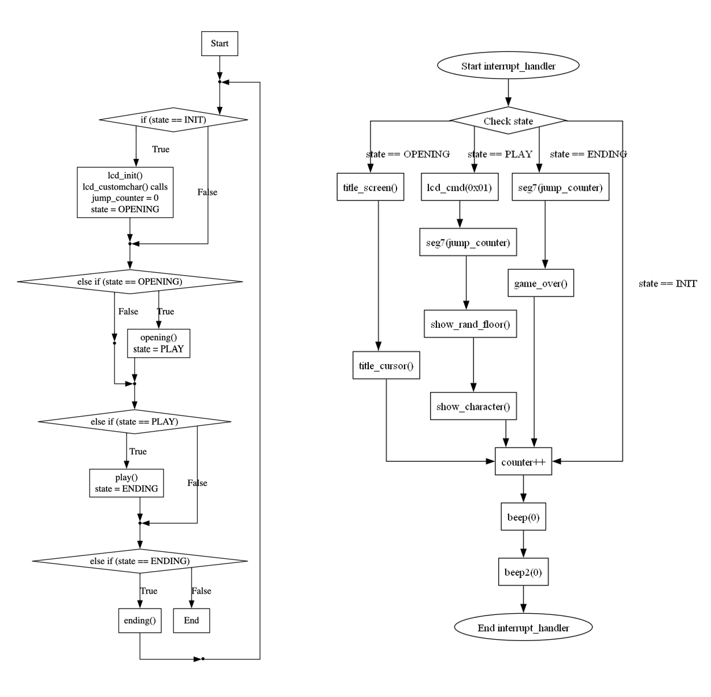
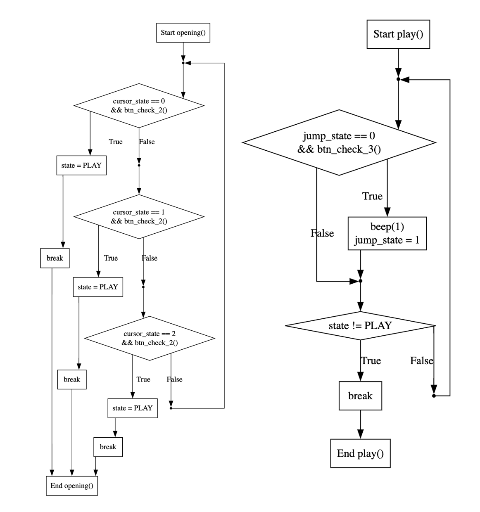
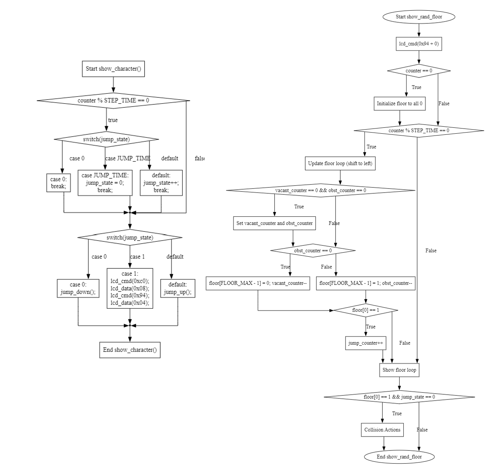
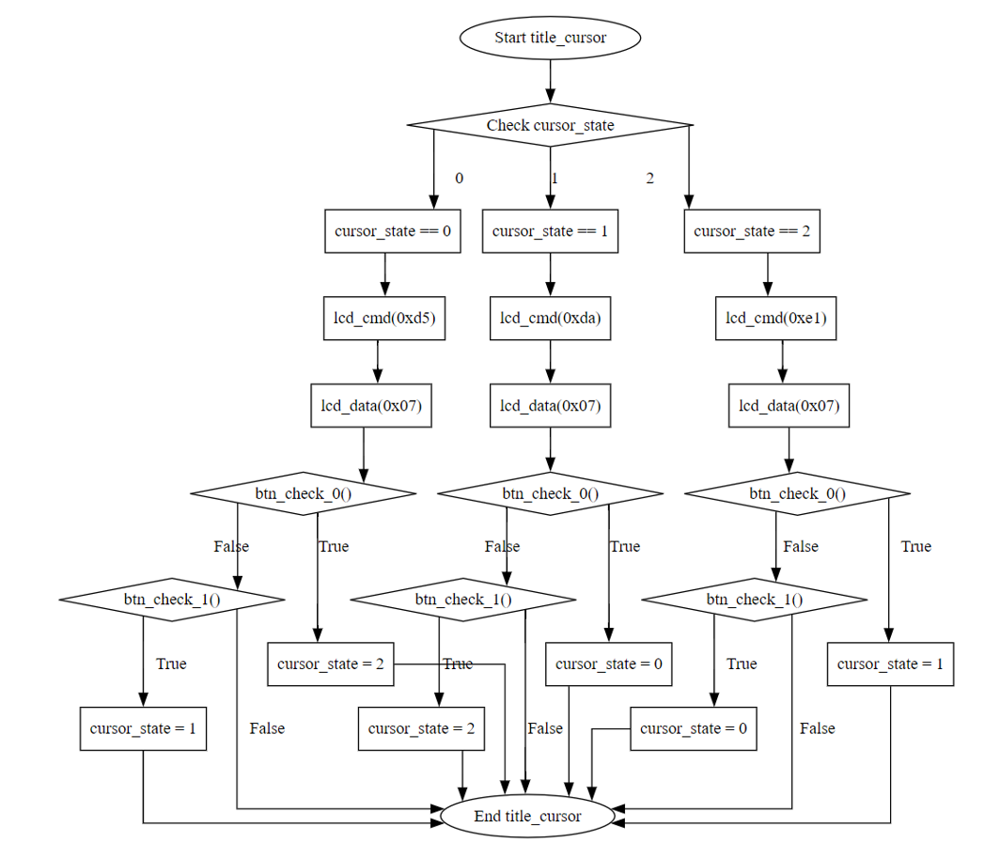

# 内部仕様書

# 用いた変数

# 状態遷移図

# 全体の流れのフローチャート

## main関数とinterrupt handler

## main()におけるopening()とplay

## iinterrupt_handler()内のshow_character()とshow_rand_floor()

## interrupt_handler()内におけるtitle_cursor()

